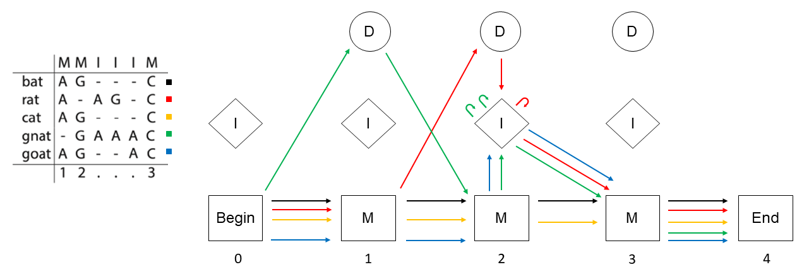

```{r setup, include=FALSE}
knitr::opts_chunk$set(echo = TRUE)
```
## Problem 8: Estimating match emission probabilities


Table 1 shows the number of observations of the symbol $a$ at position $i$ across all sequences in the multiple alignment$Ei(a)$ of our data.
```{r E, message=FALSE, warning=FALSE, echo=FALSE}
library(knitr)
df = data.frame("one" = c(4,0,0,0), "two" = c(0,0,4,0), "three" = c(0,5,0,0))
colnames(df) = 1:3
rownames(df) = c("A","C","G","T")

kable(df,caption = "$E_i(a)$")
```

With this we can calculate the match emission probabilities $e_i(a)$ by adding a pseudo-count and dividing each column by its column-sum. The resulting table is shown below. 

```{r, e, message=FALSE, warning=FALSE, echo=FALSE}
df1 = data.frame("one" = c("5/8","1/8","1/8","1/8"), "two" = c("1/8","1/8","5/8","1/8"), "three" = c("1/9","6/9","1/9","1/9"))
colnames(df1) = 1:3
rownames(df1) = c("A","C","G","T")

kable(df1,caption = "$e_i(a)$")
```

## Problem 9: Estimating insert emission probabilities

We can repeat the same procedure as above with the insert states. Again we get the observed inserts $E_i(a)$ and can use them to calculate the estimated insert emission probabilities $e_i(a)$
```{r, problem 9, message=FALSE, warning=FALSE, echo=FALSE}
df2 = data.frame("one" = c(0,0,0,0), "two" = c(5,0,1,0), "three" = c(0,0,0,0))
colnames(df2) = 1:3
rownames(df2) = c("A","C","G","T")

kable(df2,caption = "$E_i(a)$")

df3 = data.frame("one" = c("1/4","1/4","1/4","1/4"), "two" = c("6/10","1/10","2/10","1/10"), "three" = c("1/4","1/4","1/4","1/4"))
colnames(df3) = 1:3
rownames(df3) = c("A","C","G","T")

kable(df3,caption = "$e_i(a)$")
```

## Problem 10: Estimating transition probabilities

The paths of each sequence trough the profile HMM are:

$$
\begin{aligned}
\text{bat:}\quad &\text{Begin} \rightarrow M_1 \rightarrow M_2 \rightarrow M_3 \rightarrow \text{End}\\
\text{rat:}\quad &\text{Begin} \rightarrow M_1 \rightarrow D_2 \rightarrow I_2 \rightarrow I_2 \rightarrow M_3 \rightarrow \text{End}\\
\text{cat:}\quad &\text{Begin} \rightarrow M_1 \rightarrow M_2 \rightarrow M_3 \rightarrow \text{End} \\
\text{gnat:}\quad &\text{Begin} \rightarrow D_1\rightarrow M_2 \rightarrow I_2 \rightarrow I_2 \rightarrow I_2 \rightarrow M_3 \rightarrow \text{End}\\
\text{goat:}\quad &\text{Begin} \rightarrow M_1 \rightarrow M_2 \rightarrow I_2\rightarrow M_3 \rightarrow \text{End}\\
\end{aligned}
$$
With this we can draw the following diagram of the paths
<center>



We can use these paths to count $T_i(k \rightarrow l)$. The count table is the following

```{r, problem 10 part 1, message=FALSE, warning=FALSE, echo=FALSE}
df4 = data.frame("zero" = c(4,0,1,0,0,0,0,0,0), "one" = c(3,0,1,0,0,0,1,0,0), "two" = c(2,2,0,3,3,0,0,1,0), "three" = c(5,0,0,0,0,0,0,0,0))
colnames(df4) = 0:3
rownames(df4) = c("$M \\rightarrow M$","$M \\rightarrow I$","$M \\rightarrow D$","$I \\rightarrow M$","$I \\rightarrow I$","$I \\rightarrow D$","$D \\rightarrow M$","$D \\rightarrow I$","$D \\rightarrow D$")

kable(df4,caption = "$T_i(k \\rightarrow l)$")
```

With this we can estimate $t_i(k \rightarrow l)$ as:

```{r, problem 10 part 2, message=FALSE, warning=FALSE, echo=FALSE}
df5 = data.frame("zero" = c("5/8","1/8","2/8","1/3","1/3","1/3","1/3","1/3","1/3"),"one" = c("4/7","1/7","2/7","1/3","1/3","1/3","2/4","1/4","1/4"), "two" = c("3/7","3/7","1/7","4/9","4/9","1/9","1/4","2/4","1/4"), "three" = c("6/8","1/8","1/8","1/3","1/3","1/3","1/3","1/3","1/3"))
colnames(df5) = 0:3
rownames(df5) = c("$M \\rightarrow M$","$M \\rightarrow I$","$M \\rightarrow D$","$I \\rightarrow M$","$I \\rightarrow I$","$I \\rightarrow D$","$D \\rightarrow M$","$D \\rightarrow I$","$D \\rightarrow D$")

kable(df5,caption = "$t_i(k \\rightarrow l)$")
```

## Problem 11: Protein family membership classification

### 1. Run source("profileHMM.R")
```{r, problem 11 source}
source("profileHMM.R")
```

### 2. Read the two alignments ‘GTP_binding_proteins.txt’ and ‘ATPases.txt’ into memory using the function `parseAlignment()`.
```{r, problem 11 read data}
GTP_data = parseAlignment("GTP_binding_proteins.txt")
ATP_data = parseAlignment("ATPases.txt")
```
### 3. Use the function `learnHMM()` to parametrise two profile HMMs: one for each protein family (multiple alignment).

```{r, problem 11 learn}
GTP_profile = learnHMM(GTP_data)
ATP_profile = learnHMM(ATP_data)
```

### 4. Identify the position(s) with the highest match and with the highest insert emission frequencies over all symbols. Plot the respective match and insert emission frequencies for the identified positions.

#### match frequencies:

```{r, problem 11, find max, message=FALSE, warning=FALSE}
library(dplyr)
GTP_profile$mE %>% which.max() %>% arrayInd(dim(GTP_profile$mE)) -> GTP_idx
ATP_profile$mE %>% which.max() %>% arrayInd(dim(ATP_profile$mE)) -> ATP_idx

cat(
  "For GTP binding proteins the pos. with the highest match emission frequency is position",
  colnames(GTP_profile$mE)[GTP_idx[2]], "\n (with highest frequency of ",
  GTP_profile$mE[GTP_idx], ")\n")
cat("For ATPases the pos. with the highest match emission frequency is position",
    colnames(ATP_profile$mE)[ATP_idx[2]], "\n (with highest frequency of ",
    ATP_profile$mE[ATP_idx], ")\n")
```
```{r, problem 11 plotting, fig.width=10}
barplot(GTP_profile$mE[,GTP_idx[2]], ylim = c(0,1),
        main = "match emission frequencies of GTP binding proteins at position 76")
barplot(ATP_profile$mE[,ATP_idx[2]], ylim = c(0,1),
        main = "match emission frequencies of ATPases at position 7")

```

#### insert frequencies:

```{r, problem 11 find max again, message=FALSE, warning=FALSE}
library(dplyr)
GTP_profile$iE %>% which.max() %>% arrayInd(dim(GTP_profile$iE)) -> GTP_idx
ATP_profile$iE %>% which.max() %>% arrayInd(dim(ATP_profile$iE)) -> ATP_idx

cat(
  "For GTP binding proteins the pos. with the highest insert emission frequency is position",
  colnames(GTP_profile$mE)[GTP_idx[2]], "\n (with highest frequency of ",
  GTP_profile$iE[GTP_idx], ")\n")
cat("For ATPases the pos. with the highest insert emission frequency is position",
    colnames(ATP_profile$mE)[ATP_idx[2]], "\n (with highest frequency of ",
    ATP_profile$iE[ATP_idx], ")\n")
```

```{r, problem 11 plotting again, fig.width=10}
barplot(GTP_profile$iE[,GTP_idx[2]], ylim = c(0,1),
        main = "insert emission frequencies of GTP binding proteins at position 49")
barplot(ATP_profile$iE[,ATP_idx[2]], ylim = c(0,1),
        main = "insert emission frequencies of ATPases at position 70")
```

### 5. The file Unclassified proteins.txt contains 31 protein sequences from unknown families. Load the protein sequences into a list using the `parseProteins()` function.

```{r problem 11 load data}
Unclassified_data = parseProteins("Unclassified_proteins.txt")
```

### 6. The function forward() takes as input a profile HMM $\mathcal{M}$ and a sequence $x$. It returns the log odds ratio $$\log \frac{P(x \mid \mathcal{M})}{P(x \mid \mathcal{R})}$$ of the probability of observing the sequence $x$ given the model $\mathcal{M}$ versus the probability of observing the sequence $x$ given the random model $\mathcal{R}$. For each unclassified protein $x^{(i)}$ in the list, apply the forward algorithm for both models $M_1$ and $M_2$ to obtain the log odds ratio $$q(x^{(i)}):=\log \left(\frac{P(x^{(i)} \mid M_1)}{{P(x^{(i)} \mid M_2)}} \right)$$ Plot the values $q(x^i)$ and include this in your report. Which proteins in the list belong to which family? Can you clearly decide for each protein?


```{r, problem 11 q calculation}
lapply(Unclassified_data, forward, HMM = GTP_profile) %>% unlist() -> GTP_log
lapply(Unclassified_data, forward, HMM = ATP_profile) %>% unlist() -> ATP_log
q = GTP_log - ATP_log
names(q) = 1:length(q)
print(q)
```

```{r, problem 11 plotting of q, warning=FALSE, message=FALSE}
library(latex2exp)
ylab_string = TeX(r"($q(x^{(i)}))")
q_string = 
  TeX(r"($q(x^{(i)}):= \log \left(\frac{P(x^{(i)} | M_1)}{P(x^{(i)} | M_2)} \right)$)")
par(mar = c(4, 5, 5, 1))
plot(q, xlab = "index i",ylab = ylab_string, main = q_string, pch = 16, 
     col = ifelse(q < 0,'red','blue'), cex.main = 0.75)
abline(h = 0, lty = 3)
text(5, 40, labels = "GTP HMM profile", col = "blue")
text(5, -40, labels = "ATP HMM profile", col = "red")
```


We can see in the plot that we have a nice linear separation between the two models. Sequences with a positive $q$ have a higher probability to belong to the GTP binding protein family than to belong to the ATPase family. For sequences with a negative $q$ it is the other way around. Since for no sequence  $q$ is close to zero we can clearly decide for each protein.